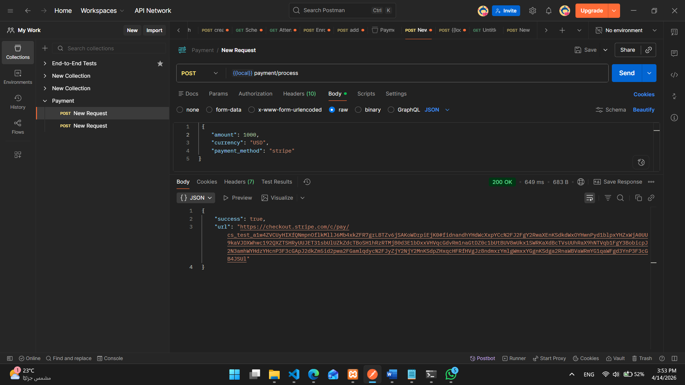
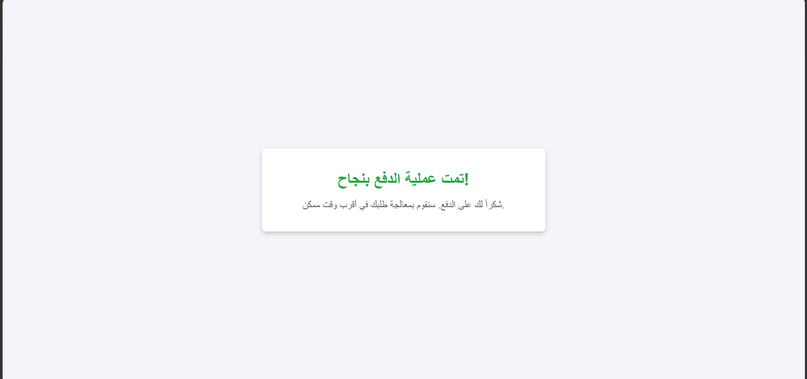
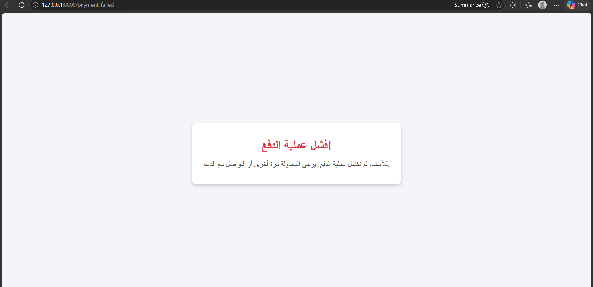
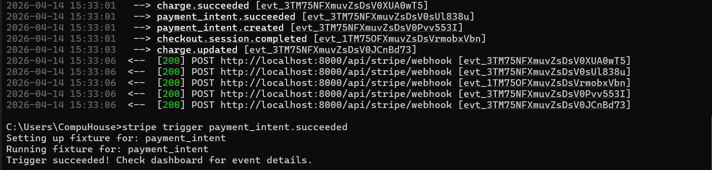

# 💳 Laravel Payment Gateway Integration

A clean, extensible payment gateway integration for Laravel using the **Strategy Design Pattern** — supports multiple payment providers with minimal code changes.

> Built with Stripe as the default provider, ready to extend with PayPal, Fawry, and more.

---

## 🏗️ Architecture Overview

```
PaymentGatewayInterface     ←   The Contract
        ↑
BasePaymentService          ←   Shared HTTP Logic
        ↑
StripePaymentService        ←   Stripe Implementation
        ↑
PaymentController           ←   Handles HTTP Layer
        ↑
AppServiceProvider          ←   Binds Interface → Service
```

---

## ✨ Features

- ✅ Strategy Design Pattern — swap payment gateways in one line
- ✅ Stripe Checkout Sessions
- ✅ Webhook signature verification
- ✅ Callback handling (success / failed)
- ✅ Easily extendable to PayPal, Fawry, Moyasar, etc.

---

## 🚀 Installation

### 1. Clone the repo

```bash
git clone https://github.com/your-username/your-repo.git
cd your-repo
```

### 2. Install dependencies

```bash
composer install
```

### 3. Copy `.env` and configure

```bash
cp .env.example .env
php artisan key:generate
```

### 4. Add Stripe keys to `.env`

```env
STRIPE_BASE_URL=https://api.stripe.com
STRIPE_SECRET_KEY=sk_test_xxxxxxxxxxxxxxxx
STRIPE_WEBHOOK_SECRET=whsec_xxxxxxxxxxxxxxxx
```

### 5. Add to `config/services.php`

```php
'stripe' => [
    'base_url'       => env('STRIPE_BASE_URL'),
    'secret_key'     => env('STRIPE_SECRET_KEY'),
    'webhook_secret' => env('STRIPE_WEBHOOK_SECRET'),
],
```

---

## 📡 API Endpoints

| Method | Endpoint | Description |
|--------|----------|-------------|
| `POST` | `/api/payment/process` | Initiate a payment |
| `GET` | `/api/payment/callback` | Stripe redirect after payment |
| `POST` | `/api/stripe/webhook` | Stripe webhook (server-to-server) |

---

## 📥 Payment Request

```json
POST /api/payment/process
Content-Type: application/json

{
    "amount": 100,
    "currency": "usd",
    "payment_method": "stripe"
}
```

---

## 🔄 Payment Flow

```
1. User sends POST /api/payment/process
        ↓
2. PaymentFactory creates StripePaymentService
        ↓
3. Stripe returns a Checkout Session URL
        ↓
4. User is redirected to Stripe's payment page
        ↓
5. User completes payment
        ↓
        ├──► Stripe redirects user ──► /callback ──► success/failed page
        │
        └──► Stripe sends Webhook ──► /stripe/webhook ──► update database
```

---

## 🔒 Webhook Security

All incoming webhook requests are verified using Stripe's signature before processing:

```php
$event = Webhook::constructEvent($payload, $signature, $secret);
```

> Requests with invalid signatures are rejected with `400 Bad Request`.

### Test webhooks locally using Stripe CLI

```bash
stripe listen --forward-to localhost:8000/api/stripe/webhook
```
 

That's it — no changes needed anywhere else. ✅

---

📸 Screenshots

## 🔐 API (Postman)


## ✅ Success Payment


## ❌ Error Payment


## 🔐 Webhook



---

## 📁 Project Structure

```
app/
├── Http/
│   └── Controllers/
│       └── PaymentController.php
├── Interfaces/
│   └── PaymentGatewayInterface.php
├── Services/
│   ├── BasePaymentService.php
│   └── StripePaymentService.php
├── Factories/
│   └── PaymentFactory.php
└── Providers/
    └── AppServiceProvider.php
```


---

## 👨‍💻 Author

Kareem Mohamed
